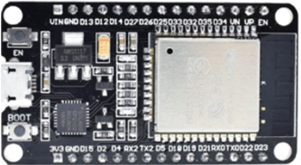
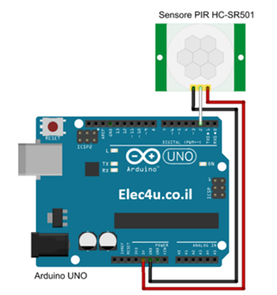
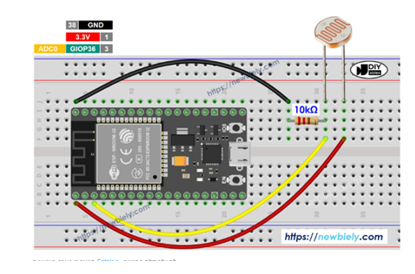
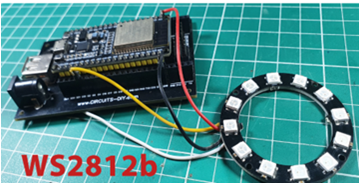
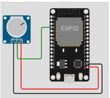
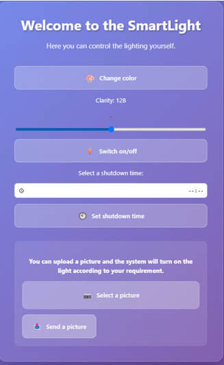

💡 SmartLight – Smart Lighting System

🔍 Quick Overview

Smart IoT lighting system based on ESP32
Built with C++ (Arduino), React (app), and WiFi communication
Includes sensors, automation, and remote control

🧠 Description

SmartLight is an intelligent lighting system designed to reduce energy consumption and improve user comfort.
The system automatically detects motion and ambient light levels and adjusts lighting accordingly. It also allows full manual control through buttons, potentiometer, and a mobile/web application.
The project combines hardware (ESP32 + sensors) with software (embedded code + web app) to create a complete smart home solution.

✨ Features

🔐 Motion-based automatic lighting (PIR sensor)
🌗 Adaptive brightness based on natural light (LDR sensor)
🎨 RGB color control (NeoPixel LED ring)
⏰ Automatic scheduled shutdown (RTC clock)
📱 Remote control via WiFi web/app
🔘 Manual brightness & color control
💡 Real-time status display on LCD screen

🛠️ Technologies Used

Microcontroller: ESP32
Programming: C++ (Arduino)
Frontend: React
Communication: HTTP / WiFi

Libraries:

WiFi.h
WebServer.h
Adafruit_NeoPixel
LiquidCrystal_I2C
RtcDS1302
📸 System Components
ESP32 Controller

PIR Motion Sensor

LDR Light Sensor

RGB LED Ring (NeoPixel)

LCD Display (I2C)
Potentiometer (manual brightness control)
Button (color switching)
RTC Clock Module (DS1302)

⚙️ How It Works
PIR sensor detects movement in the room
LDR measures ambient light intensity
ESP32 processes data and decides lighting level
LED ring turns on with appropriate brightness and color
User can override system manually (hardware or app)
RTC module turns lights off automatically at scheduled time

🧩 Architecture

Input Layer
Motion sensor (PIR)
Light sensor (LDR)
User input (button, potentiometer, app)
Processing Layer
ESP32 handles all logic and decision making
Controls automation rules and timing
Output Layer
RGB LED lighting system
LCD display status updates
Communication Layer
WiFi connection
HTTP requests between app and ESP32

📱 App Features

Turn lights ON/OFF remotely
Change LED colors
Adjust brightness level
Set automatic shutdown time
Send commands via WiFi in real time

📸 Screenshots

🚀 Installation

git clone https://github.com/chanyRavid/SmartLight
cd SmartLight

Upload code to ESP32
Connect hardware components
Configure WiFi credentials
Run the application
Access system via IP address
🧠 Challenges & Learnings
Synchronizing multiple hardware components
Debugging sensor inaccuracies
Working with RTC time synchronization
Handling WiFi and server communication
Integrating hardware + software into one system
🔮 Future Improvements

AI-based user behavior learning
Motion-based security system
Temperature-based automation (AC control)
Voice control integration
Cloud-based remote control system

👩‍💻 Author

Chany Ravid
